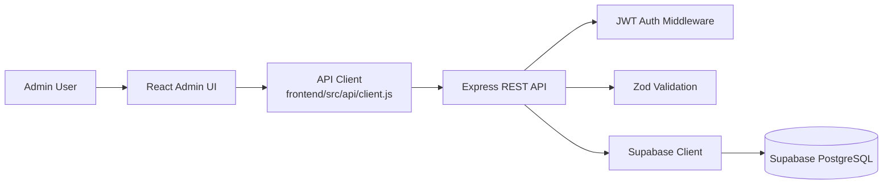
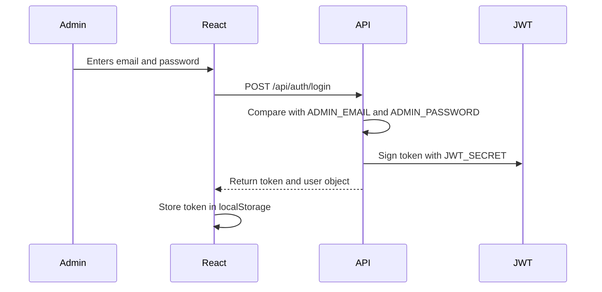
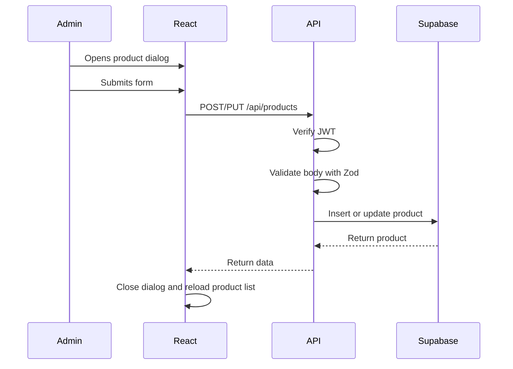

# Architecture

## Overview

The application uses a three-layer full-stack architecture:

```text
React Admin UI -> Express REST API -> Supabase PostgreSQL
```

The React frontend handles admin workflows and session storage. The Express API
owns validation, authentication, routing, and database access. Supabase stores
catalog, category, order, and order item data.

## High-Level Architecture Diagram



## Frontend

The frontend is a Vite React app. It stores the JWT in `localStorage` after login
and sends it in the `Authorization` header for protected API calls.

Major screens:

- Login
- Dashboard
- Products
- Categories
- Orders

Important frontend behavior:

- `App.jsx` controls the active page and login state.
- `Layout.jsx` provides navigation and sign out.
- Product and category create/edit workflows use dialogs.
- Product and category delete actions require confirmation dialogs.
- API errors are displayed in-page or inside the dialog that caused the action.

## Backend

The backend is an Express API. Routes are grouped by domain:

- Auth routes issue JWTs.
- Product routes manage catalog records.
- Category routes manage catalog structure.
- Order routes expose fulfillment status updates.
- Dashboard routes aggregate database records into operational stats.

Zod validates request bodies before database writes.

Backend modules:

| Module | Responsibility |
| --- | --- |
| `src/app.js` | Creates the Express app and mounts routes |
| `src/index.js` | Loads environment variables and starts the server |
| `src/middleware/auth.js` | Validates `Authorization: Bearer <token>` |
| `src/validators/schemas.js` | Defines Zod request validation schemas |
| `src/routes/*.routes.js` | Implements domain-specific REST endpoints |
| `src/supabaseClient.js` | Creates the Supabase service-role client |

## Database

Supabase PostgreSQL stores normalized ecommerce CMS data:

- `categories`
- `products`
- `orders`
- `order_items`

Products reference categories. Order items reference orders and products.

## Data Flow

1. Admin signs in from React.
2. Backend verifies configured admin credentials.
3. Backend returns a JWT.
4. React stores the token.
5. React calls protected endpoints with the token.
6. Express validates requests and calls Supabase.
7. Supabase returns persistent data to the API.
8. React renders dashboard, forms, tables, and order controls.

## Authentication Flow



## Product CRUD Flow



## Runtime Configuration

Backend environment variables:

| Variable | Purpose |
| --- | --- |
| `ADMIN_EMAIL` | Demo admin login email |
| `ADMIN_PASSWORD` | Demo admin login password |
| `JWT_SECRET` | Secret used to sign JWT tokens |
| `SUPABASE_URL` | Supabase project URL |
| `SUPABASE_SERVICE_ROLE_KEY` | Backend-only Supabase service key |
| `PORT` | API server port, default `4000` |

Frontend environment variables:

| Variable | Purpose |
| --- | --- |
| `VITE_API_URL` | API base URL, default `http://localhost:4000/api` |

## Security Notes

- The Supabase service role key is used only by the backend.
- The frontend never receives the Supabase service role key.
- Protected API routes require a JWT bearer token.
- This assignment uses simple admin credentials for demo scope, not production-grade user management.
