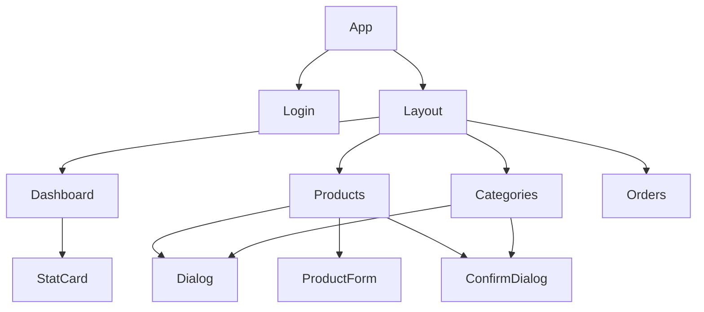
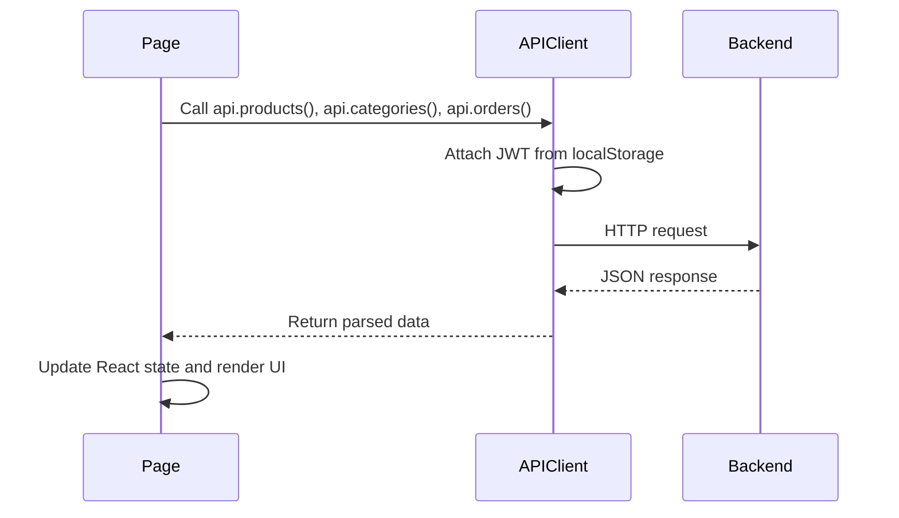

# Component Hierarchy

```text
App
  Login
  Layout
    Dashboard
      StatCard
    Products
      Dialog
      ProductForm
      ConfirmDialog
    Categories
      Dialog
      ConfirmDialog
    Orders
```

## Component Diagram



## Component Responsibilities

`App`

- Tracks login state.
- Stores and clears the JWT.
- Switches between admin pages.

`Layout`

- Provides the persistent navigation shell.
- Handles page navigation and sign out.

`Login`

- Collects admin credentials.
- Calls the login API.
- Displays authentication errors.

`Dashboard`

- Loads aggregate stats from the backend.
- Shows product, stock, order, and revenue metrics.

`Products`

- Loads products and categories.
- Provides product search and filters.
- Opens dialogs for product create/edit.
- Opens confirmation dialog before product deletion.

`ProductForm`

- Shared create/edit form for product data.
- Used inside a product dialog.

`Dialog`

- Reusable modal structure.
- Handles Escape key closing.
- Provides title, description, close button, and content area.

`ConfirmDialog`

- Reusable destructive-action warning dialog.
- Used before deleting products and categories.

`Categories`

- Opens dialogs for category create/edit.
- Opens confirmation dialog before category deletion.

`Orders`

- Lists orders and updates fulfillment status.

## Frontend State Responsibilities

| Component | Main State |
| --- | --- |
| `App` | JWT token and active page |
| `Login` | email, password, loading, login error |
| `Dashboard` | dashboard stats and loading error |
| `Products` | product list, categories, filters, active dialog, selected product |
| `Categories` | category list, active dialog, selected category |
| `Orders` | order list and update errors |

## Frontend Data Flow


