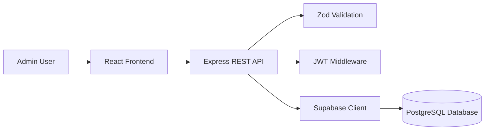
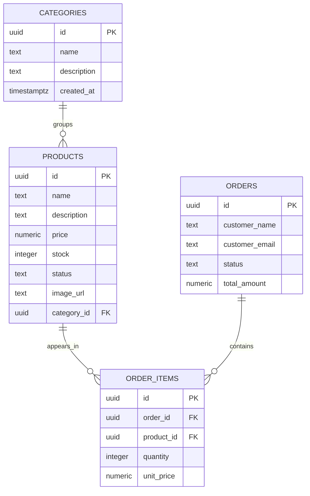
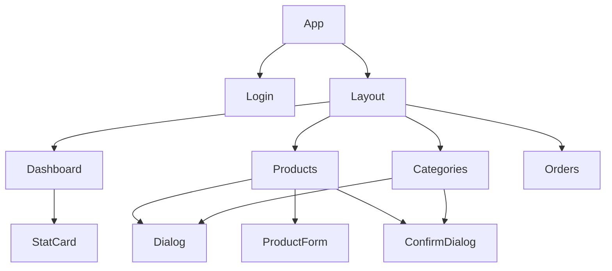

# Database and Architecture

## Architecture

## Database Model

## Table Purpose

| Table | Purpose |
| --- | --- |
| `categories` | Product grouping |
| `products` | Catalog records with pricing and stock |
| `orders` | Customer order headers |
| `order_items` | Products and quantities in orders |

## Important Design Decisions

- Products remain in the database when a category is deleted; their category becomes null.
- Order items remain tied to the order; deleting an order removes its items.
- Product deletion does not delete historical order items.
- Supabase service role key is used only in the backend.
- The frontend talks to the Express API instead of directly accessing Supabase.

## Component Hierarchy

